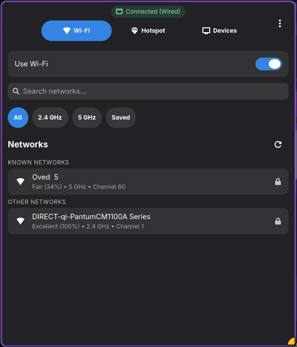
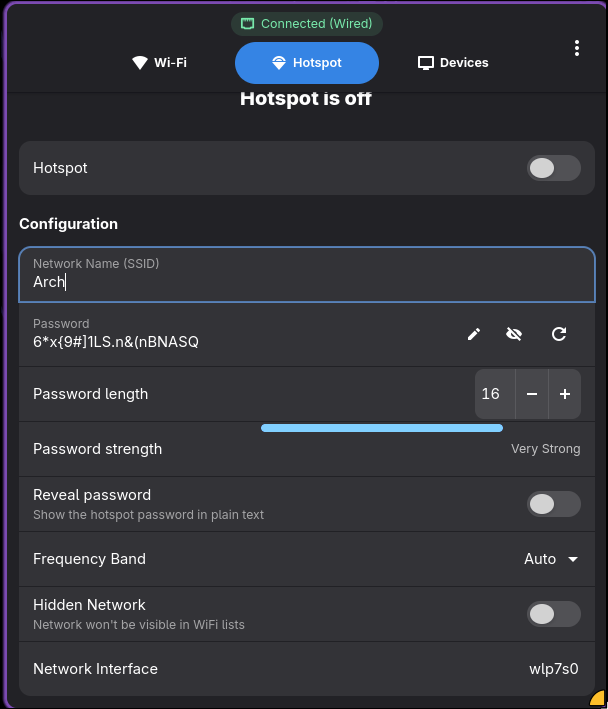
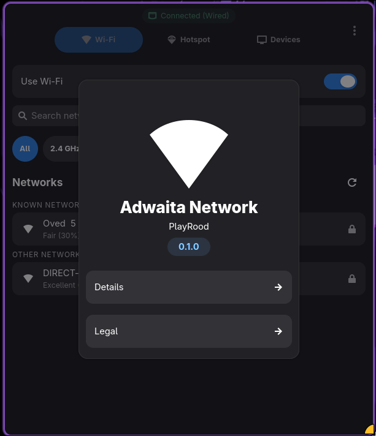

<div align="center">

# Adwaita Network

[](https://opensource.org/licenses/GPL-3.0)
[](https://www.rust-lang.org)
[](https://gtk.org)

Modern network manager for GNOME.

Clean WiFi and hotspot management with an Adwaita-native UI.

[Features](#features) • [Installation](#installation) • [Whats-New](#whats-new) • [Usage](#usage) • [Building](#building-from-source)

</div>

---

## 🖼️ Screenshots

<div align="center">
  
  
  
</div>

## ✨ Features

- WiFi scan, connect, and manage with signal quality indicators
- Hotspot creation and configuration
- QR code sharing for quick mobile connection
- Real-time device list for active hotspot
- Adwaita UI with light/dark theme support
- Auto refresh for networks and devices
- WPA/WPA2/WPA3 and hidden SSID support
- Network details: band, channel, security, and signal strength
- Auto-reconnect to saved networks

---

## 🆕 Whats New

This release focuses on UI/UX polish and stability across WiFi, hotspot, and device views.

### 📶 WiFi Page
- Signal strength visualization (Excellent/Good/Fair/Weak/Very weak)
- Password entry uses AlertDialog (no inline expansion)
- Saved networks connect without prompting
- Context menu actions: Connect/Disconnect, Forget, Show QR
- Loading indicators for refresh and connection attempts
- Detailed network info: band, channel, and security type
- Clear disabled state with "Turn On Wi-Fi" action

### 🔥 Hotspot Page
- Separate Start/Stop and Save Configuration actions
- Settings locked while hotspot is active
- State indicator with icon and color
- Automatic interface detection
- Operation-in-progress guard to prevent concurrent start/stop

### 🖥️ Devices Page
- Improved device discovery via ARP and lease sources
- Hostname resolution where available
- Device-type icons (phone vs computer)
- Auto-refresh only while hotspot is active

### 🧩 General
- Polkit prompts documented and expected
- Consistent AlertDialog usage across the app
- Cleaner lists and responsive layout
- Error handling and logging improvements
- Respects system GTK theme

---

## 🚀 Installation

### 📦 From AUR (Arch Linux)
```bash
yay -S adw-network-bin
```

### ✅ Prerequisites

Required system dependencies:
- GTK4 >= 4.10
- libadwaita >= 1.6
- NetworkManager (running)
- Rust >= 1.70 (for building from source)
- GDK Pixbuf 2.0

Runtime requirements:
- NetworkManager must be running and enabled
- Your user must have permissions to manage NetworkManager (typically via polkit)
- Some operations require administrator privileges and will show a system authentication dialog

---

## 🛠️ Building from Source

### 📥 Install Build Dependencies

<details>
<summary><b>Arch Linux</b></summary>
sudo pacman -S base-devel rust gtk4 libadwaita gdk-pixbuf2 networkmanager
</details>

<details>
<summary><b>Ubuntu/Debian</b></summary>
sudo apt install build-essential cargo libgtk-4-dev libadwaita-1-dev libgdk-pixbuf-2.0-dev network-manager pkg-config
</details>

<details>
<summary><b>Fedora</b></summary>
sudo dnf groupinstall "Development Tools"

sudo dnf install rust cargo gtk4-devel libadwaita-devel gdk-pixbuf2-devel NetworkManager pkg-config
</details>

### 🧱 Compile & Install
```bash
# Clone repository
git clone https://github.com/PlayRood32/adw-network.git
cd adw-network

# Build release
cargo build --release

# Install (see BUILD & RUN INSTRUCTIONS section for complete steps)
sudo install -Dm755 target/release/adwaita-network /usr/bin/adwaita-network

sudo install -Dm644 data/com.github.adw-network.desktop /usr share/applications/com.github.adw-network.desktop

```

---

## 📖 Usage

### 📶 WiFi Management

1. Enable WiFi: toggle the WiFi switch in the WiFi tab
2. Scan networks: click refresh or wait for automatic scan
3. Signal strength: quality labels indicate expected performance
4. Connect:
   - Saved networks: click to connect immediately
   - Open networks: click to connect
   - Secured networks: enter password in dialog
5. Details: view band, channel, and security type
6. Context menu:
   - Connect/Disconnect
   - Forget Network
   - Show QR Code

### 🔥 Hotspot Setup

1. Configure:
   - Network name (SSID)
   - Password (8-63 characters) or leave empty for open network
   - Frequency band (2.4 GHz, 5 GHz, Auto)
   - Hidden network toggle
   - Interface selection (auto-detected)
2. Save configuration without starting
3. Start hotspot
4. Stop hotspot before changing settings
5. Share via QR code
6. Monitor clients in the Devices tab

### 🧭 Device Monitoring

- View connected devices with IP, MAC, and hostname (when available)
- Device icons for phones and computers
- Auto-refresh every 5 seconds while hotspot is active

---

## 🗂️ Project Structure
```
├── 📁 data
│   ├── 📁 icons
│   │   └── 📁 hicolor
│   │       └── 📁 scalable
│   │           └── 📁 apps
│   │               └── 🖼️ icon.png
│   └── 📄 com.github.adw-network.desktop
├── 📁 docs
│   └── 📁 images
│       ├── 🖼️ screenshot-1.png
│       ├── 🖼️ screenshot-2.png
│       └── 🖼️ screenshot-3.png
├── 📁 src
│   ├── 📁 ui
│   │   ├── 🦀 devices_page.rs
│   │   ├── 🦀 hotspot_page.rs
│   │   ├── 🦀 mod.rs
│   │   └── 🦀 wifi_page.rs
│   ├── 🦀 config.rs
│   ├── 🦀 hotspot.rs
│   ├── 🦀 lib.rs
│   ├── 🦀 main.rs
│   ├── 🦀 nm.rs
│   ├── 🦀 qr.rs
│   ├── 🦀 qr_dialog.rs
│   └── 🦀 window.rs
├── ⚙️ .gitignore
├── ⚙️ Cargo.toml
├── 📄 LICENSE
└── 📝 README.md
```

---

## 🧪 Troubleshooting

<details>
<summary><b>Administrator password dialog keeps appearing</b></summary>

This is expected. NetworkManager requires elevated privileges for:
- Creating hotspots
- Connecting to new networks
- Modifying network configurations

The system authentication dialog is managed by Polkit and cannot be integrated into the app.
</details>

<details>
<summary><b>No networks appear in WiFi list</b></summary>

- Ensure WiFi is enabled
- Verify NetworkManager is running: `systemctl status NetworkManager`
- Check adapter status: `nmcli device status`
- Scanning takes a few seconds; watch the refresh indicator
- Check logs: `~/.local/share/adw-network/adwaita-network.log`
</details>

<details>
<summary><b>GTK theme parser warnings</b></summary>

If you set `GTK_THEME` to a non-GTK4-compatible theme, you may see parser warnings (e.g., `shade`, `mix`, `-gtk-icon-effect`).
Unset `GTK_THEME` or switch to a GTK4-compatible theme to resolve.
</details>

<details>
<summary><b>Cannot modify hotspot settings while it's running</b></summary>

This is by design. Stop the hotspot before editing settings, then save and start again.
</details>

<details>
<summary><b>Hotspot fails to start</b></summary>

- Ensure you have administrator privileges
- Verify adapter supports AP mode:
```bash
  iw list | grep "Supported interface modes" -A 10
```
  Look for "AP" in the output
- Try 2.4 GHz for better compatibility
- Ensure no other connection is using the same interface
- Check logs for errors
</details>

---

## 🤝 Contributing

1. Fork the repository
2. Create a feature branch (`git checkout -b feature/amazing-feature`)
3. Make changes
4. Test thoroughly
5. Commit (`git commit -m 'Add amazing feature'`)
6. Push (`git push origin feature/amazing-feature`)
7. Open a Pull Request

### 🧹 Code Style

- Run `cargo fmt`
- Run `cargo clippy`
- Write clear commit messages
- Update documentation for new features

---

## 📝 Configuration

- Hotspot config: `~/.config/adw-network/hotspot.json`
- Application logs: `~/.local/share/adw-network/adwaita-network.log`

---

## 🐛 Known Issues

- Hotspot activation can take a few seconds on some systems
- 5 GHz support depends on hardware capabilities
- Some adapters do not support AP mode
- Polkit dialogs appear outside the app

Report bugs at: [GitHub Issues](https://github.com/PlayRood32/adw-network/issues)

---

## 📄 License

This project is licensed under **GPL-3.0-or-later**. See [LICENSE](LICENSE) for details.

---

## 📬 Support

- Issues: [GitHub Issues](https://github.com/PlayRood32/adw-network/issues)
- Discussions: [GitHub Discussions](https://github.com/PlayRood32/adw-network/discussions)

---

## 🎯 Roadmap

- [ ] VPN integration
- [ ] Mobile data support
- [ ] Network speed monitoring
- [ ] Custom DNS configuration
- [ ] Ethernet connection management
- [ ] Network profiles (home/work/public)
- [ ] Bandwidth limiting for hotspot
- [ ] MAC address filtering for hotspot

---

## 🙏 Credits & Inspirations

- [airctl](https://github.com/pshycodr/airctl) for signal visualization ideas
- GNOME Settings for network UI patterns
- NetworkManager for backend capabilities
- GTK4 and libadwaita for the application framework

### 🧰 Key Dependencies

- [gtk4-rs](https://gtk-rs.org/)
- [libadwaita-rs](https://world.pages.gitlab.gnome.org/Rust/libadwaita-rs/)
- [qrcode](https://github.com/kennytm/qrcode-rust)
- [tokio](https://tokio.rs/)
- [serde](https://serde.rs/)
- [anyhow](https://github.com/dtolnay/anyhow)
- [image](https://github.com/image-rs/image)
- [rand](https://rust-random.github.io/rand/)
- [chrono](https://github.com/chronotope/chrono)
- [env_logger](https://github.com/rust-cli/env_logger/)
- [log](https://github.com/rust-lang/log)

---

## ⭐ Show Your Support

If you found this project useful, consider giving it a star.

[](https://github.com/PlayRood32/adw-network)

<div align="center">

[Back to Top](#adwaita-network)
</div>
