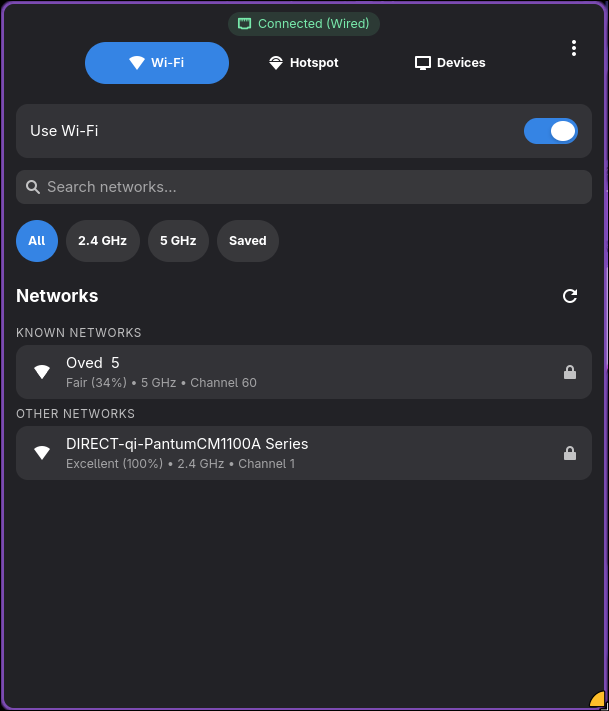
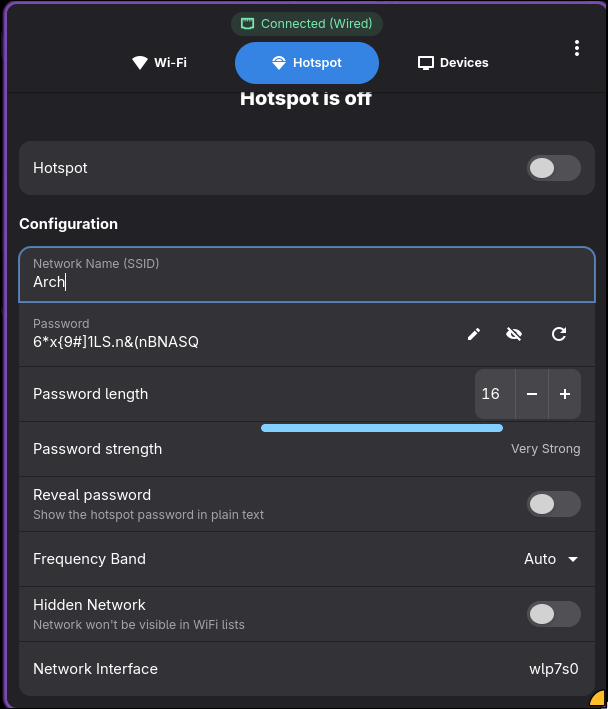
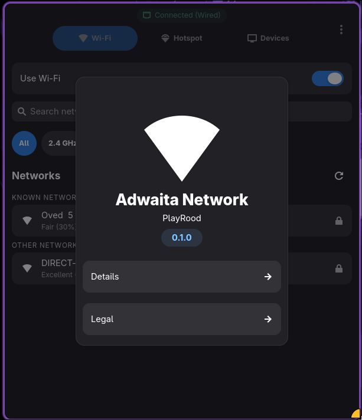

<div align="center">

# Adwaita Network

[](https://opensource.org/licenses/GPL-3.0)
[](https://www.rust-lang.org)
[](https://gtk.org)

Modern network manager for GNOME.

Clean Wi-Fi and hotspot management with an Adwaita-native UI.

[What It Does](#-what-it-does) • [Hotspot Workflow](#-hotspot-workflow) • [Installation](#-installation) • [Usage](#-usage) • [Development](#-development)

</div>

Modern network management for GNOME, built with Rust, GTK4, and libadwaita.

Adwaita Network focuses on three things:

- clean Wi-Fi and Ethernet management
- a hotspot workflow that feels native on the desktop
- per-device hotspot control without dropping to shell scripts

Current app version: `1.0.0`

## 🖼️ Screenshots

<div align="center">
  
  
  
</div>

---

## ✨ What It Does

### 📊 Status

- show live upload/download speed in the header bar for the active primary connection
- show current connection state for Wi-Fi, wired, or hotspot

### 📶 Wi-Fi

- scan nearby networks
- connect to open, secured, and hidden networks
- show signal strength, band, channel, and security details
- show QR codes for saved Wi-Fi networks
- manage auto-connect and custom DNS for active connections

### 🔥 Hotspot

- create and stop a hotspot directly from the app
- use an explicit `Apply Changes` flow for hotspot configuration
- generate a temporary guest password for one hotspot session
- share the active hotspot password through a QR code
- select band, channel, hidden SSID mode, and interface
- set global upload/download shaping
- set a maximum connected-device count

### 🖥️ Per-Device Hotspot Control

- see connected device names when available from leases or reverse DNS
- manage each connected device from the `Devices` page
- manually block or unblock a device by MAC address
- set per-device upload/download speed limits
- set per-device connected-time quotas
- set per-device upload/download quotas
- block specific sites per device with a domain block list

### 🔌 Devices

- list connected hotspot clients with hostname, IP, MAC, and lease information
- categorize devices with icons based on hostname/vendor hints
- open a per-device policy dialog directly from the list
- show mobile-data controls through ModemManager when available

### 🧭 Profiles and VPN

- create connection profiles such as `Home`, `Work`, or `Public`
- assign Wi-Fi, Ethernet, and supported VPN connections to profiles
- manage WireGuard and OpenVPN connections from the app

---

## 🔄 Hotspot Workflow

The hotspot page now uses an explicit apply model:

1. Change the hotspot settings.
2. Click `Apply Changes` to save them.
3. If the hotspot is already running, the app reapplies the configuration.
4. If the hotspot is off, the settings are stored and used on the next start.

Starting the hotspot from the toggle still uses the values currently shown in the UI, so you do not have to click `Apply Changes` first when you are simply starting a new hotspot.

---

## 🔑 Temporary Guest Password

The app can generate a temporary guest password from the hotspot page.

- it is meant for short-lived sharing
- it stays active until the next time the hotspot is turned off
- after the hotspot stops, the app clears it automatically

Important note:

- NetworkManager exposes a single active hotspot password at a time
- because of that, the temporary guest password replaces the active hotspot password for that session instead of creating two simultaneous PSKs

---

## 📋 Device Policies and Quotas

Per-device rules are stored by MAC address and can include:

- manual block
- upload speed limit
- download speed limit
- connected-time quota
- upload quota
- download quota
- blocked domains

The quota reset policy is configurable in `Settings`:

- `Never reset`
- `Reset daily at 00:00`

---

## 🎯✅ Feature Status

<ul>
  <li><input type="checkbox" checked disabled> VPN integration</li>
  <li><input type="checkbox" checked disabled> Mobile data support</li>
  <li><input type="checkbox" checked disabled> Network speed monitoring</li>
  <li><input type="checkbox" checked disabled> Custom DNS configuration</li>
  <li><input type="checkbox" checked disabled> Ethernet connection management</li>
  <li><input type="checkbox" checked disabled> Network profiles (home/work/public)</li>
  <li><input type="checkbox" checked disabled> Bandwidth limiting for hotspot</li>
  <li><input type="checkbox" checked disabled> MAC address filtering for hotspot</li>
</ul>


---

## ✅ Requirements

### Runtime Requirements

- NetworkManager
- GTK4-compatible desktop session
- permissions to manage NetworkManager, usually through polkit

Optional components:

- `ModemManager` for mobile-data controls
- a Secret Service-compatible keyring for the default keyring-backed hotspot password storage
- `tc` for upload/download shaping
- `nft` / nftables for MAC blocking, device limits, quotas, and blocked sites
- NetworkManager VPN plugins for WireGuard/OpenVPN handling

### Build Requirements

- Rust toolchain
- GTK4 development files
- libadwaita development files
- GDK Pixbuf development files
- `pkg-config`

---

## 🛠️ Building from Source

### 📥 Install Build Dependencies

<details>
<summary><b>Arch Linux</b></summary>

sudo pacman -S base-devel rust gtk4 libadwaita gdk-pixbuf2 networkmanager
</details>

<details>
<summary><b>Ubuntu/Debian</b></summary>

sudo apt install build-essential cargo libgtk-4-dev libadwaita-1-dev libgdk-pixbuf-2.0-dev network-manager pkg-config
</details>

<details>
<summary><b>Fedora</b></summary>

sudo dnf groupinstall "Development Tools"

sudo dnf install rust cargo gtk4-devel libadwaita-devel gdk-pixbuf2-devel NetworkManager pkg-config
</details>

### 🧱 Compile & Install

```bash
# Clone repository
git clone https://github.com/PlayRood32/adw-network.git
cd adw-network

# Build release
cargo build --release

# Install (see BUILD & RUN INSTRUCTIONS section for complete steps)
sudo install -Dm755 target/release/adwaita-network /usr/bin/adwaita-network
sudo install -Dm644 data/com.github.adw-network.desktop /usr/share/applications/com.github.adw-network.desktop
```

or for Arch btw users

```
yay -S adw-network
```

---

## 📖 Usage

### 📶 Wi-Fi

1. Open the `Wi-Fi` page.
2. Turn Wi-Fi on if needed.
3. Refresh or wait for auto-scan.
4. Choose a network or use `Hidden Network`.
5. Use the context menu for actions such as disconnect, forget, or QR code sharing.

### 🔥 Hotspot

1. Open the `Hotspot` page.
2. Set SSID, password, band, channel, visibility, and interface.
3. Optionally generate a temporary guest password.
4. Optionally configure advanced controls such as speed limits, max devices, and client rules.
5. Click `Apply Changes` to store changes.
6. Use the toggle to start or stop the hotspot.

### 🖥️ Device Management

1. Open the `Devices` page while the hotspot is running.
2. Review the connected devices list.
3. Click `Manage` on a device or use the context menu.
4. Save a rule to block, throttle, quota-limit, or site-limit that device.

### ⚙️ Settings

Use `Settings` to control:

- theme mode
- hotspot password storage mode
- hotspot quota reset policy
- auto-scan behavior
- navigation layout and visible modules

---

## 📁 Configuration Files

- hotspot config: `~/.config/adw-network/hotspot.json`
- app settings: `~/.config/adw-network/settings.json`
- profiles: `~/.config/adw-network/profiles.json`
- hotspot runtime state: `~/.local/share/adw-network/hotspot-runtime.json`
- logs: `~/.local/share/adw-network/adwaita-network.log`

---

## 🗂️ Project Layout

```text
├── 📁 data
│   ├── 📁 icons
│   │   └── 📁 hicolor
│   │       └── 📁 scalable
│   │           └── 📁 apps
│   │               └── 🖼️ icon.png
│   └── 📄 com.github.adw-network.desktop
├── 📁 docs
│   └── 📁 images
│       ├── 🖼️ screenshot-1.png
│       ├── 🖼️ screenshot-2.png
│       └── 🖼️ screenshot-3.png
├── 📁 src
│   ├── 📁 ui
│   │   ├── 🦀 hotspot_page
│   │   │   ├── 🦀 actions.rs
│   │   │   ├── 🦀 mod.rs
│   │   │   └── 🦀 password.rs
│   │   ├── 📁 wifi_page
│   │   │   ├── 🦀 actions.rs
│   │   │   ├── 🦀 details.rs
│   │   │   ├── 🦀 dialogs.rs
│   │   │   └── 🦀 mod.rs
│   │   ├── 🦀 common.rs
│   │   ├── 🦀 devices_page.rs
│   │   ├── 🦀 ethernet_page.rs
│   │   ├── 🦀 mod.rs
│   │   └── 🦀 profiles_page.rs
│   ├── 🦀 config.rs
│   ├── 🦀 hotspot_runtime.rs
│   ├── 🦀 hotspot.rs
│   ├── 🦀 leases.rs
│   ├── 🦀 lib.rs
│   ├── 🦀 main.rs
│   ├── 🦀 modem_manager.rs
│   ├── 🦀 nm_dbus.rs
│   ├── 🦀 nm.rs
│   ├── 🦀 profiles.rs
│   ├── 🦀 qr_dialog.rs
│   ├── 🦀 qr.rs
│   ├── 🦀 secrets.rs
│   ├── 🦀 state.rs
│   └── 🦀 window.rs
├── 📦🦀 Cargo.toml
├── ⚙️ com.github.adw-network.json
├── ⚖️ LICENSE
└── 📖 README.md
```

---

## 🧪 Troubleshooting

<details>
<summary><b>I keep getting an administrator password dialog</b></summary>

That is expected for operations that change NetworkManager state, such as:

- starting or stopping a hotspot
- creating or modifying connections
- applying network changes that require privileged access
</details>

<details>
<summary><b>Hotspot changes did not apply</b></summary>

- use `Apply Changes` after editing the hotspot settings
- if the hotspot is already active, the app will reapply the configuration
- if reapply fails, check the log for the exact NetworkManager or driver error
</details>

<details>
<summary><b>The hotspot will not start</b></summary>

Check the following:

- your adapter supports AP mode
- `NetworkManager` is running
- the chosen interface is not already in use by another active Wi-Fi connection
- `tc` and `nft` are installed if you enabled advanced hotspot controls

AP mode check:

```bash
iw list | grep "Supported interface modes" -A 10
```

Look for `AP` in the output.
</details>

<details>
<summary><b>Device quotas or blocked sites are not enforced</b></summary>

- install `nftables`
- make sure the hotspot is active
- if you configured speed shaping, install `tc` as well
- after editing rules, save them from the dialog or use `Apply Changes`
</details>

<details>
<summary><b>No devices appear in the Devices page</b></summary>

- confirm that the hotspot is active
- refresh the page manually
- verify that lease files are readable on the host
- check the app log for `ip neigh` or lease-loading warnings
</details>

---

## ⚠️ Known Limits

- hotspot startup can still take a few seconds on some hardware
- 5 GHz support depends on adapter and regulatory domain support
- some adapters do not support AP mode at all
- blocked sites are domain-to-IP based, so they are best-effort rather than a full proxy-style content filter
- the temporary guest password is a temporary replacement for the active hotspot password, not a second simultaneous WPA key

---

## 🧰 Key Rust Crate Versions

The README is aligned with `Cargo.toml`.

<details>
<summary><b>View all crate versions</b></summary>

- `gtk4 = 0.11.2`
- `libadwaita = 0.9.1`
- `gdk-pixbuf = 0.22.0`
- `image = 0.25.10`
- `glib = 0.22.5`
- `gio = 0.22.5`
- `tokio = 1.51.1`
- `anyhow = 1.0.101`
- `rand = 0.10.1`
- `qrcode = 0.14.1`
- `serde = 1.0.228`
- `serde_json = 1.0.149`
- `log = 0.4.29`
- `env_logger = 0.11.10`
- `chrono = 0.4.44`
- `tempfile = 3.27.0`
- `hostname = 0.4.2`
- `keyring = 3.6.3`
- `uuid = 1.23.0`
- `zbus = 5.14.0`
- `zvariant = 5.9.2`
- `dns-lookup = 3.0.1`
</details>

---

## 🔧 Development

Recommended checks:

```bash
cargo fmt
cargo check
cargo test
```

---

## 📄 License

GPL-3.0-or-later. See [LICENSE](LICENSE).

---

## 📬 Support

- issues: <https://github.com/PlayRood32/adw-network/issues>
- discussions: <https://github.com/PlayRood32/adw-network/discussions>
